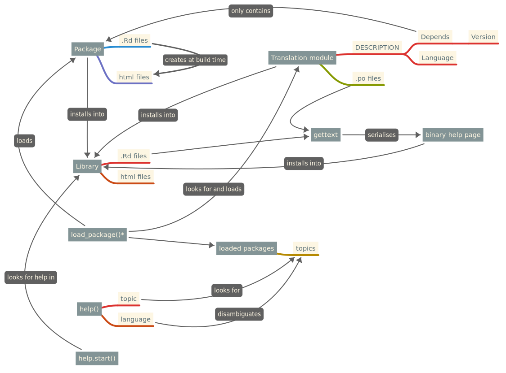

# Internationalisation of R help pages

This repository documents a proposal to support internationalisation of R help pages.

# How it's supposed to work

-   Original packages have their "canonical" help pages written in the original languages.

-   Translations are hosted in a translation module that uses the package format.
    Users can install those modules themselves.
    These modules use the PackageType field to indicate that they are a translation module (e.g. PackageType: translation).
    The Depends field is used to indicate the package being translated and the minimum version supported.

-   Translation modules would store .po files with the translated strings.

-   At install time, the .Rd files of the original package are parsed and translated using `gettext()` and the .po files in the translation module and serialised into binary help pages (like regular packages have).

-   When loading a package, R will also search for installed translations and load them too.

-   `help()` gains an new "language" argument which defaults to `Sys.getenv("LANGUAGE")`.

-   `help()` searches for the loaded topics.
    If any translation is available, then it would use the `language` argument to disambiguate.

-   Help pages should include a link to the original (canonical) documentation.

# Concept map

