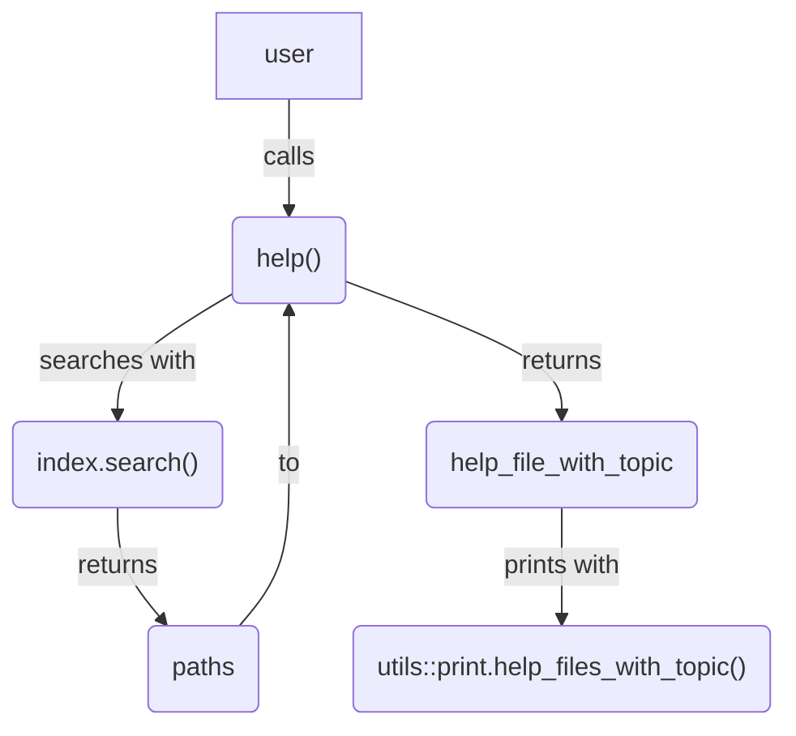
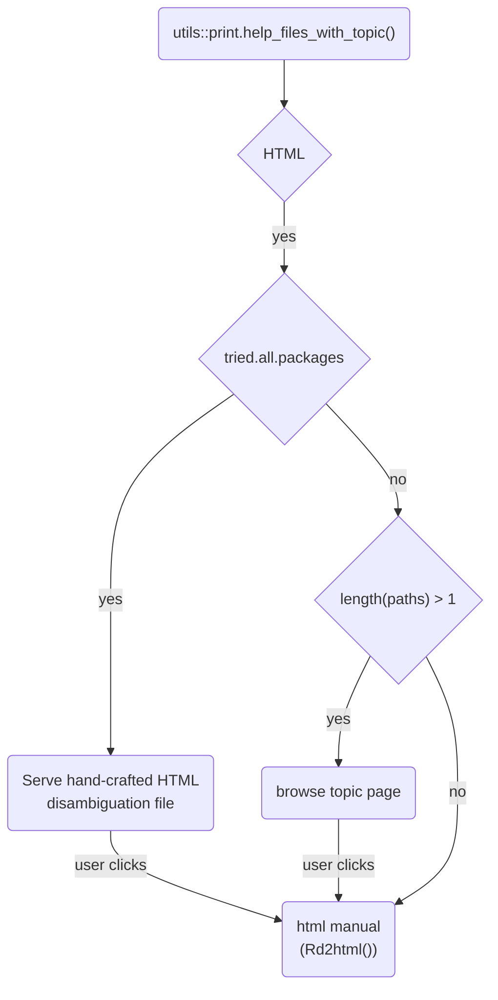

https://github.com/r-devel/r-svn/blob/7443ac74ccaa5e780273b1eb308eaf4b7a7e89f4/src/library/utils/R/help.R#L91

 ```r
print.help_files_with_topic <- function(x, ...) {
```

First it gets some variables. 

```r
    browser <- getOption("browser")
    topic <- attr(x, "topic")
    type <- attr(x, "type")
    if (.Platform$GUI == "AQUA" && type == "html")
        browser <- get("aqua.browser", envir = as.environment("tools:RGUI"))
```

`getOption("browser")` will return the default function to open URLs. 

If there paths is nothing (i.e. there are not results), just print that nothing's there
```r
 if(!length(paths)) {
        writeLines(c(gettextf("No documentation for %s in specified packages and libraries:",
                              sQuote(topic)),
                     gettextf("you could try %s",
                              sQuote(paste0("??", topic)))))
        return(invisible(x))
    }
```

Start the help server if necessary

```r
    port <- if(type == "html") tools::startDynamicHelp(NA) else NULL
```

Now the code gets hard to read because it includes a lot of long nested if-else statements. Perhaps this could eventually be refactored to a more concise form with early returns. 

**Case 1:** If the paths were arrived at by trying all packages, then add a message and add the disambiguation part. 

```r
 if(attr(x, "tried_all_packages")) {
        paths <- unique(dirname(dirname(paths)))
        msg <- gettextf("Help for topic %s is not in any loaded package but can be found in the following packages:",
                        sQuote(topic))
        if (type == "html" && port > 0L) {
            path <- file.path(tempdir(), ".R/doc/html")
            dir.create(path, recursive = TRUE, showWarnings = FALSE)
            out <- paste0('<!DOCTYPE html>\n',
                          '<html>\n',
                          '<head>\n<title>R: help</title>\n',
                          '<meta http-equiv="Content-Type" content="text/html; charset=utf-8" />\n',
                          '<meta name="viewport" content="width=device-width, initial-scale=1.0, user-scalable=yes" />\n',
                          '<link rel="stylesheet" type="text/css" href="/doc/html/R.css" />\n',
                          '</head>\n<body>\n<div class="container">\n\n<hr>\n')
            out <- c(out, '<p>', msg, '</p><br>')
            out <- c(out, '<table style="width: 100%;">\n',
                     '<tr style="text-align: left; vertical-align: top;">\n',
                     '<td style="width: 25%;">Package</td><td>Library</td></tr>\n')
            pkgs <- basename(paths)
            links <- paste0('<a href="http://127.0.0.1:', port,
                            '/library/', pkgs, '/help/', topic, '">',
                            pkgs, '</a>')
            out <- c(out, paste0('<tr style="text-align: left; vertical-align: top;">\n',
                                '<td>', links, '</td><td>',
                                dirname(paths), '</td></tr>\n'))
            out <- c(out, "</table>\n<hr>\n</div>\n</body>\n</html>")
            writeLines(out, file.path(path, "all.available.html"))
            browseURL(paste0("http://127.0.0.1:", port,
                             "/doc/html/all.available.html"),
                      browser)
```

For the html help, it creates an html section with the disambiguation, saves it to a temporary directory and opens the browser to that file. I'm not sure how does the server resolve `localhost:{port}/doc/html/all.available.html` to the `{tempdir()}/.R/doc/html"`. Must be some hard-coded thing. 

For non-html help, it writes the message and the paths to a file to stdout. 
```r
  } else {
            writeLines(c(strwrap(msg), "",
                         paste0("  ",
                                formatDL(c(gettext("Package"), basename(paths)),
                                         c(gettext("Library"), dirname(paths)),
                                         indent = 22))))
        }
```


**Case 2:** If paths were arrived without trying all packages (i.e. the help page is either in one of the loaded packages or in the package expressly supplied by the user). 

```r
} else {
```

If there's more than one path... 

```r
        if(length(paths) > 1L) {
```

If the help file is html and the Dynamic Help is running, then serve `/library/NULL/help/{topic}` and bolt out.   
```r
            if (type == "html" && port > 0L) { # Redo the search if dynamic help is running
		browseURL(paste0("http://127.0.0.1:", port,
                                 "/library/NULL/help/",
                                 URLencode(topic, reserved = TRUE)),
                          browser)
		return(invisible(x))
	    }
```

This is the most common case, I think. `127.0.0.1:10463/library/NULL/help/{topic}`  resolves to the help section of that topic. For example, `http://127.0.0.1:10463/library/NULL/help/mean`  will redirect to `http://127.0.0.1:10463/library/base/html/mean.html`, which shows the manual for `base::mean()`. 

It is aware of loaded packages, so, for instance, `http://127.0.0.1:10463/library/NULL/help/filter` will redirect to `http://127.0.0.1:10463/library/stats/html/filter.html` (`stats::filter()` manual), if no package is loaded, but it will show to a disambiguation page if you then load dplyr. 

This not only means that the help server does a lot of heavy lifting, but that it basically ignores the paths returned by `help()`. Notice that the chunk above doesn't use the `path` variable at all!

If the html help is not to be used (either because `html_type` is not html or because `startDynamicHelp()` failed for some reason) then it will do some disambiguation. First it will write text to stout: 

```r
            file <- paths[1L]
            p <- paths
            msg <- gettextf("Help on topic %s was found in the following packages:",
                            sQuote(topic))
            paths <- dirname(dirname(paths))
            txt <- formatDL(c("Package", basename(paths)),
                            c("Library", dirname(paths)),
                            indent = 22L)
            writeLines(c(strwrap(msg), "", paste0("  ", txt), ""))
```

Then, 

```r
            if(interactive()) {
                fp <- file.path(paths, "Meta", "Rd.rds")
                tp <- basename(p)
                titles <- tp
                if(type == "html" || type == "latex")
                    tp <- tools::file_path_sans_ext(tp)
                for (i in seq_along(fp)) {
                    tmp <- try(readRDS(fp[i]))
                    titles[i] <- if(inherits(tmp, "try-error"))
                        "unknown title" else
                    tmp[tools::file_path_sans_ext(tmp$File) == tp[i], "Title"]
                }
                txt <- paste0(titles, " {", basename(paths), "}")
                ## the default on menu() is currtently graphics = FALSE
                res <- menu(txt, title = gettext("Choose one"),
                            graphics = getOption("menu.graphics"))
                if(res > 0) file <- p[res]
            } else {
                writeLines(gettext("\nUsing the first match ..."))
            }
            
```

In a non-interactive session (last `else`), it will just use the first match (`file <- paths[1]` in the previous chunk). 

In an interactive session, it will prompt the user to decide with help file to open. 

It will read a file called Rd.rds inside the Meta folder of each package. This file is a data.frame with columns File, Name, Type, Title, Encoding, Aliases, Concepts, and Keywords. So, data about the contents of each .Rd file. For each result in paths, it will get the Title of each .Rd file in `titles`, which will be used to prompt the user with a disambiguation menu with `menu()` and assign the result to `file`. 

None of this is needed if paths is of length one. In that case, `file` is just the original `paths`. 

```r
        else
            file <- paths
```

Now, file is just one file, which is either the one that the user chose or the first one, it finally opens up the help.

```r
        if(type == "html") {
          if (port > 0L) {
            path <- dirname(file)
            dirpath <- dirname(path)
            pkgname <- basename(dirpath)
            browseURL(paste0("http://127.0.0.1:", port,
                             "/library/", pkgname, "/html/", basename(file),
                             ".html"),
                      browser)
          } else {
            warning("HTML help is unavailable", call. = FALSE)
            att <- attributes(x)
            xx <- sub("/html/([^/]*)\\.html$", "/help/\\1", x)
            attributes(xx) <- att
            attr(xx, "type") <- "text"
            print(xx)
          }
```

For html help, this will finally open up the browser in the correct location. This section is very strange because the help server at `127.0.0.1:10463/library/NULL/help/{topic}`  already does this redirect, so this logic seems to be duplicated!

If the help server is not available (`port <= 0`), then it prints a warning and will try again with help type as text by changing the `type` attribute and calling print again. This is also strange, as I think this has the same effect as just falling through to the next else block. Also, I think this fallback should've been done right after trying to `startDynamicHelp()` check if `port > 0L` and if not, emit the warning and change `type` to `"text"`. Then you can continue the code assuming that the server is running, if requested. 

Anyway, for text help, it writes the .Rd file into plain text and opens up the file. 

```r
 else if (type == "text") {
      pkgname <- basename(dirname(dirname(file)))
      temp <- tools::Rd2txt(.getHelpFile(file), out = tempfile("Rtxt"), 
        package = pkgname)
      file.show(temp, title = gettextf("R Help on %s", 
        sQuote(topic)), delete.file = TRUE)
    }
```

(For some reason this doesn't seem to work on RStudio.)

And for the grand finale

```r
 else if(type %in% "pdf") {
            path <- dirname(file)
            dirpath <- dirname(path)
            texinputs <- file.path(dirpath, "help", "figures")
            tf2 <- tempfile("Rlatex")
            tools::Rd2latex(.getHelpFile(file), out = tf2)
            .show_help_on_topic_offline(tf2, topic, type, texinputs)
            unlink(tf2)
        }
```

For `type == "pdf"` (historically probably this included other formats, hence the `%in%`),  it writes the .Rd to latex and probably renders it to pdf. On my machine this fails with ``! LaTeX Error: File `inconsolata.sty' not found.``. 

And the last line, returns the input invisibly. 

```r
    }

    invisible(x)
}
```







